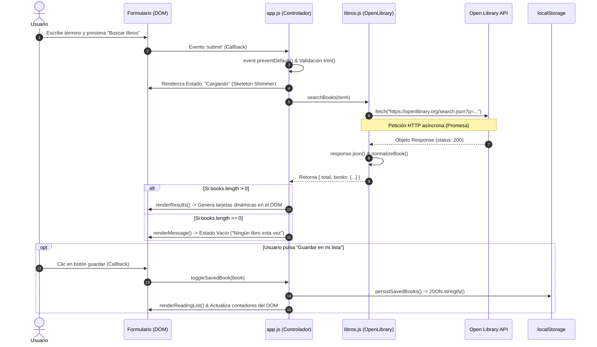

<div align="center">


# 📚 BookFinder — Explorador de Libros

> *“Biblioteca abierta para mentes curiosas — Encuentra el libro que te mueve.”*

[](https://developer.mozilla.org/es/docs/Web/JavaScript)
[](https://developer.mozilla.org/es/docs/Web/HTML)
[](https://developer.mozilla.org/es/docs/Web/CSS)
[](https://openlibrary.org/developers/api)
[](https://developer.mozilla.org/es/docs/Web/API/Window/localStorage)

<br/>

**Práctica Calificada EP · Ingeniería de Software**  
*Ejercicio Integrador 2: Aplicación Cliente con Asincronía, DOM y API Pública*

</div>

---

## 👥 Integrantes del Equipo

| # | Apellidos y Nombres | Rol / Aporte |
| :-: | :--- | :--- |
| **1** | **Rodrigo Gutiérrez Lazo** | Arquitectura JS, Consumo de API (Fetch/Promesas) y Lógica de Estados |
| **2** | **Luis Vila Meza** | Sistema de Diseño Editorial CSS3, Layouts Responsivos y Accesibilidad |
| **3** | **Grecia Vila Navarro** | Manipulación del DOM, Gestión de Eventos y Persistencia en `localStorage` |

---

## 📖 1. Propósito y Problema que Resuelve

Durante el ciclo universitario, los estudiantes necesitan consultar y recopilar material bibliográfico confiable sobre diferentes materias sin realizar búsquedas manuales dispersas. 

**BookFinder** proporciona una interfaz ágil, reactiva y elegante para:
1. Buscar en segundos millones de títulos a través de la API pública de **Open Library**.
2. Conocer de inmediato autores, años de publicación, portadas y detalles editoriales.
3. Consultar la sinopsis oficial mediante una ventana modal interactiva sin salir de la página.
4. Armar una **Lista de Lectura** personalizada que permanece guardada en el navegador aunque se recargue la página.

---

## 🎨 2. Sistema de Diseño Editorial

La interfaz fue diseñada bajo una estética **editorial contemporánea**, inspirada en bibliotecas clásicas y publicaciones académicas de alta gama:

```
┌────────────────────────────────────────────────────────────────────────┐
│  --paper:       #f4f1e9  (Fondo cálido tipo pergamino)                 │
│  --green:       #245c49  (Verde bosque institucional y botones)        │
│  --green-dark:  #173e32  (Acento oscuro de alto contraste)             │
│  --lime:        #d7e77c  (Acento vibrante para badges y contadores)    │
│  --coral:       #d2765d  (Acento terracota para etiquetas y alertas)   │
│  --ink:         #20231f  (Tinta profunda para texto legible)           │
│  --line:        #deddd4  (Líneas divisorias sutiles)                   │
└────────────────────────────────────────────────────────────────────────┘
```

* **Tipografía Display:** `Fraunces` (Google Fonts) — Tipografía Serif de alto impacto para encabezados y portadas tipográficas dinámicas.
* **Tipografía de Lectura:** `DM Sans` (Google Fonts) — Sans-serif nítida, geométrica y con excelente legibilidad en pantallas móviles y de escritorio.
* **Diseño Responsivo Total:** Cuadrículas fluidas (*CSS Grid*) con *breakpoints* optimizados para monitores ultra-wide, laptops, tablets y smartphones.

---

## ✨ 3. Funcionalidades Principales

* 🔍 **Búsqueda en Tiempo Real:** Filtro rápido por palabras clave, materias de estudio o títulos, acompañado de sugerencias directas (*psicología*, *astronomía*, *literatura*).
* 🛡️ **Validación Síncrona:** Detección de campos vacíos con mensajes accesibles (`role="alert"`) y foco automático sin disparar llamadas innecesarias a la red.
* 🖼️ **Portadas Inteligentes:** Carga asíncrona de portadas desde el CDN de Open Library con generación de portadas tipográficas elegantes cuando el libro carece de imagen.
* 📖 **Ficha Detallada Modal (`<dialog>`):** Ventana accesible con información de publicación, editorial, número de ediciones, materias y descripción de la obra (`/works/...json`).
* 📌 **Lista de Lectura Persistente:** Colección lateral (*Reading List*) con contador dinámico en tiempo real y persistencia en `localStorage`.
* ⚡ **Control de Concurrencia (*Race Condition Guard*):** Manejador de versiones en cada búsqueda para descartar respuestas antiguas si el usuario escribe varias consultas consecutivas.
* 🍞 **Notificaciones Toast:** Alertas no intrusivas en pantalla al agregar o eliminar elementos de la lista.

---

## 🔄 4. Flujo de Asincronía y Ciclo de Datos

El siguiente diagrama detalla cómo viaja la información desde la interacción del usuario hasta la actualización en pantalla:



---

## 🖥️ 5. Gestión de los 5 Estados de la Interfaz

| Estado | Aspecto Visual | Mecanismo en el Código |
| :--- | :--- | :--- |
| **1. Inicial / Bienvenida** | Ilustración de libros estilizados con paleta del sistema y mensaje orientador. | Contenedor `.welcome-state` presente en el DOM al cargar la página. |
| **2. Cargando** | 6 tarjetas de esqueleto (*skeleton loader*) con animación de gradiente infinito (*shimmer*). | Invocación de `renderLoading()` en [app.js](file:///c:/Users/LENOVO/Documents/Proyectos/IW-EP%20-%20Bookfinder/js/app.js) antes de la resolución del `await`. |
| **3. Resultados** | Cuadrícula dinámica de libros con títulos, autores, etiquetas de año y botones de acción. | Función `renderResults(currentBooks)` inyectando tarjetas en `#results-grid`. |
| **4. Vacío** | Mensaje empático *"Ningún libro esta vez / No encontramos coincidencias"*. | Condicional `if (result.books.length === 0)` tras procesar la respuesta de la API. |
| **5. Error** | Tarjeta de advertencia visual con borde terracota y mensaje de asistencia al usuario. | Bloque `catch (searchError)` ejecutado si falla la conexión de red o la API de Open Library. |

---

## 📁 6. Estructura de Archivos del Proyecto

```text
IW-EP-Bookfinder/
│
├── index.html          # Documento semántico HTML5 estructurado (Hero, Search, Grid, Aside, Dialog)
├── README.md           # Documentación visual y técnica del repositorio
├── ENTREGA_EP.md       # Ficha formal para entrega en el aula virtual
│
├── assets/
│   └── banner.svg      # Banner vectorial con la identidad visual del proyecto
│
├── css/
│   └── estilos.css     # Hoja de estilos con variables CSS, Grid/Flexbox, animaciones y media queries
│
└── js/
    ├── app.js          # Orquestador del DOM, callbacks de eventos, gestión de estados y persistencia
    └── libros.js       # Servicio cliente de Open Library (Fetch API, Promesas y normalización de datos)
```

---

## 📊 7. Matriz de Cumplimiento Técnico (Rúbrica Oficial)

| Criterio Evaluado | Peso | Estado | Evidencia en el Código |
| :--- | :---: | :---: | :--- |
| **1. Funcionamiento y demostración** | **25 %** | 🏆 Sobresaliente | Búsqueda fluida, modal interactivo, guardado/eliminado de lista y estados de error/carga sin recarga de página. |
| **2. Conocimiento de HTML y CSS** | **15 %** | 🏆 Sobresaliente | Etiquetas semánticas (`<dialog>`, `<aside>`, `<article>`), variables CSS (`:root`), Flexbox/Grid y diseño responsivo sin librerías externas. |
| **3. Conocimiento de JavaScript** | **15 %** | 🏆 Sobresaliente | Código estructurado en módulos IIFE independientes, funciones puras de normalización y validación limpia. |
| **4. Manipulación del DOM** | **15 %** | 🏆 Sobresaliente | Creación dinámica con *template literals*, sanitización con `escapeHTML`, actualización reactiva de contadores y uso de `showModal()`. |
| **5. JavaScript asincrónico** | **15 %** | 🏆 Sobresaliente | Consumo de Open Library mediante `fetch()` con `async/await`, control de `response.ok`, parsing JSON y control de concurrencia. |
| **6. Comprensión global del código** | **15 %** | 🏆 Sobresaliente | Separación de responsabilidades: `libros.js` maneja datos/red y `app.js` maneja la interfaz de usuario. |

---

## 🎯 8. Guía Rápida para la Sustentación Técnica

Respuestas a las preguntas formuladas en la guía de evaluación:

<details>
<summary><b>1. ¿Qué sucede cuando el usuario pulsa "Buscar"?</b> (Clic para desplegar)</summary>
<br>

El evento `submit` del formulario es interceptado por un *callback* en `app.js`. Se aplica `event.preventDefault()` para evitar la recarga del navegador, se valida que el texto no esté vacío con `.trim()`, se activa el estado de carga (`renderLoading`) y se despacha la función asíncrona `search(term)`.
</details>

<details>
<summary><b>2. ¿Por qué <code>fetch()</code> no devuelve directamente los datos?</b> (Clic para desplegar)</summary>
<br>

Porque `fetch()` es una operación asíncrona no bloqueante que retorna una **Promesa**. Dicha promesa resuelve primero un objeto `Response` con las cabeceras HTTP antes de que el cuerpo de los datos termine de transferirse por la red.
</details>

<details>
<summary><b>3. ¿Dónde se procesa la respuesta y dónde se convierte a JSON?</b> (Clic para desplegar)</summary>
<br>

En `js/libros.js`:
- En la línea donde se evalúa `if (!response.ok) throw new Error(...)` se procesa el código de estado HTTP.
- En la instrucción `const data = await response.json();` se lee y parsea el cuerpo de la respuesta convirtiéndolo en un objeto JavaScript iterable.
</details>

<details>
<summary><b>4. ¿Cómo se crea una tarjeta dinámicamente?</b> (Clic para desplegar)</summary>
<br>

Mediante la función `renderBookCard(book, index)` en `app.js`. Esta función interpola las propiedades del libro en un *template string* HTML con atributos de datos (`data-id`, `data-action`) y luego se inserta masivamente en el contenedor `#results-grid` modificando la propiedad `innerHTML`.
</details>

<details>
<summary><b>5. ¿Cómo se elimina un libro del DOM y de la lista?</b> (Clic para desplegar)</summary>
<br>

Mediante delegación de eventos en el documento. Al hacer clic en un elemento con `data-action="remove"`, se extrae el identificador del libro, se filtra el arreglo `savedBooks = savedBooks.filter(b => b.id !== id)`, se sincroniza en `localStorage` y se re-ejecuta `renderReadingList()` para refrescar la interfaz.
</details>

<details>
<summary><b>6. ¿Qué ocurre si la búsqueda devuelve cero resultados?</b> (Clic para desplegar)</summary>
<br>

La API responde exitosamente pero con `docs: []`. El código detecta `if (result.books.length === 0)` y activa el estado de visualización vacía mediante `renderMessage()`, orientando al estudiante a probar con otros términos.
</details>

<details>
<summary><b>7. ¿Qué modificarías para ordenar los resultados?</b> (Clic para desplegar)</summary>
<br>

Se puede modificar la consulta en `libros.js` pasando el parámetro `sort: 'new'` en la URL de Open Library, o bien ordenar localmente el arreglo antes del renderizado con:
```javascript
result.books.sort((a, b) => (b.year || 0) - (a.year || 0)); // Del más reciente al más antiguo
```
</details>

---

## 🚀 9. Puesta en Marcha

No se requieren gestores de paquetes ni servidores Node.js complejos:

1. **Clonar el repositorio:**
   ```bash
   git clone https://github.com/RodrigoGutierrezLazo/IW-EP-Bookfinder.git
   ```
2. **Entrar al directorio:**
   ```bash
   cd IW-EP-Bookfinder
   ```
3. **Ejecutar:**
   - Haz doble clic sobre el archivo `index.html` para abrirlo directamente en tu navegador favorito (Chrome, Edge, Firefox, Safari).
   - O ejecútalo con cualquier extensión de servidor local como *Live Server* en VS Code.

---

<div align="center">
  <sub>Desarrollado con dedicación para la Práctica Calificada EP · 2026</sub>
</div>